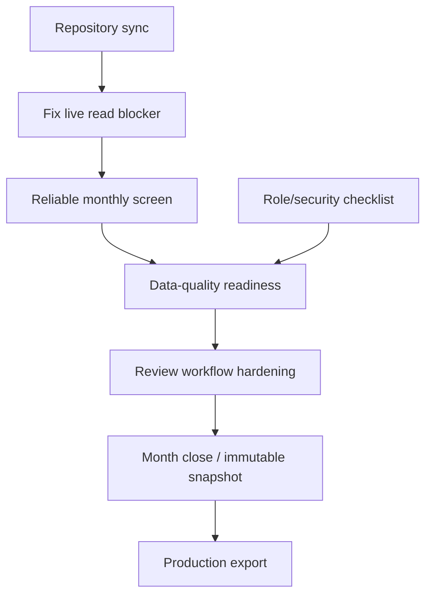

# System Readiness Summary

Date: 2026-07-11  
Repository: `witalijolchowik-coder/toyota-payroll`  
Live application: `https://witalijolchowik-coder.github.io/toyota-payroll/`

## Current overall readiness

The system is an advanced MVP foundation, not a production-ready payroll system.

Ready now:

- application shell;
- Firebase Auth login with appUsers access control;
- employee register review and limited setup work;
- template-based employee import/update foundation;
- settings/departments foundations;
- many pure payroll calculation helpers and tests.

Not ready:

- live Monthly Settlement workflow;
- live Absences workflow;
- final payroll calculation authority;
- month closing/freeze;
- production export;
- full audit trail;
- real operational data-quality gate.

## Should real employee data import proceed?

Recommendation: **No — pause expansion of real employee data import.**

Reason:

- The live app already shows real employee rows, but core monthly workflows currently fail to load.
- The pre-import security checklist is still not completed in documentation.
- Missing employment/identity/department/setup readiness is not yet enforced strongly enough.

Limited exception:

- A controlled, administrator-reviewed employee setup pilot may continue only if no payroll export/settlement decisions depend on it yet.

## Should operational use begin?

Recommendation: **No for monthly payroll operation.**

Employees/setup review can be piloted. Monthly settlement, absences, review and exports should not be used operationally until blockers are fixed.

## Top critical blockers

1. Monthly Settlement live page fails to load.
2. Absences live page fails to load.
3. Reports route is placeholder and export is not production-gated.
4. Payroll calculation is client-side/in-memory draft only.
5. Audit log is defined but not populated by normal operations.
6. Local Git workspace is not cleanly synchronized with remote published history.

## Top five recommended next blocks

1. **Production Firebase read blocker fix**
   - Add collection-group absence read rules/index tests.
   - Fix Monthly Settlement and Absences live loading.

2. **Repository state reconciliation**
   - Bring local clone into clean alignment with published `main`.
   - Prevent accidental implementation files from entering audit/report commits.

3. **Pre-import security and role gate**
   - Complete `docs/security/pre-import-checklist.md`.
   - Decide and enforce role capabilities.
   - Verify approved, inactive and unapproved accounts.

4. **Data-quality readiness**
   - Require or block missing `employment_start`.
   - Surface missing PESEL/passport/foreign document for SOZ.
   - Validate department/shift/entitlement readiness.

5. **Month close and export gate**
   - Define immutable settlement snapshot.
   - Add server-authoritative calculation/closing.
   - Validate Toyota/SOZ output against real sample files.

## Dependencies

## Known audit limitations

- The live audit did not create, edit or delete real records.
- Monthly Settlement grid, review panel and export panel could not be visually audited live because Monthly Settlement failed to load.
- Absence table workflow could not be fully audited live because Absences failed to load.
- No screenshots were committed because the live app contains real employee data.
- Local verification results:
  - `pnpm format:check`: passed.
  - `pnpm lint`: passed.
  - `pnpm typecheck`: passed.
  - `pnpm test:unit`: blocked locally by the known Windows/Codex `spawn EPERM` Vite/Vitest startup limitation.
  - `pnpm test:rules`: blocked locally because the Firebase emulator could not spawn `java -version` from PATH.
  - `pnpm build`: TypeScript passed, then Vite build was blocked locally by the same `spawn EPERM` limitation.
- CI remains the authoritative verification path after publishing.
